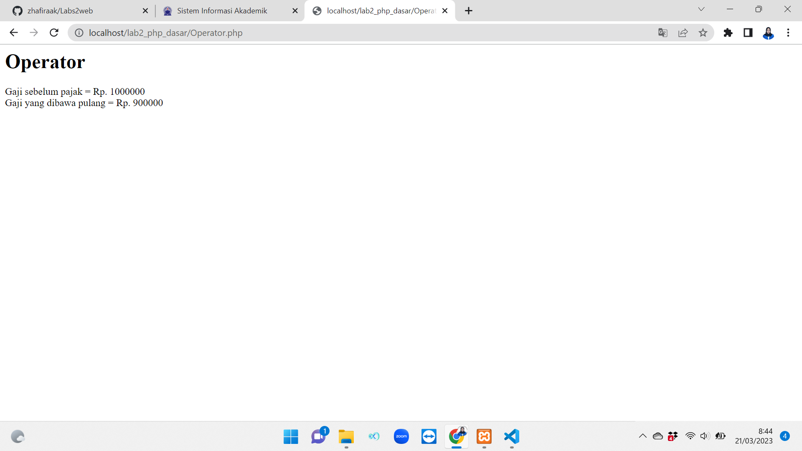

# Labs2web

### Biodata
__Nama  : Zhafira Abadiningrum Khafianti__

__Nim   : 312110067__

__Kelas : T1.21.A.1__

## Memulai PHP
<p>Buat folder `Lab2_php_dasar` pada root direktori web server (C:\xampp\htdocs)


  
## Install XAMPP
1. Unduh XAMPP [Disini](https://www.apachefriends.org/download.html) dan sesuaikan dengan sistem operasi kalian, lalu pilih versi php (disini saya pilih PHP 8). lalu klik Download.
2. Kemudian buka installer XAMPP nya, setelah itu next - next saja hingga selesai.
3. Secara default XAMPP itu akan disimpan dalam Local Disk (C:)
4. Buka XAMPP Control Panel.
5. Lalu klik Start pada Apache dan MySQL.


6. Kemudian uji coba apakah web server sudah bekerja dengan baik dengan mengetik http://127.0.0.1 atau http://localhost
  
## Latihan 1

```py
<!DOCTYPE html>
<html lang="en">

<head>
    <meta charset="UTF-8">
    <title>PHP Dasar</title>
</head>

<body>
    <h1>Belajar PHP Dasar</h1>
    <?php
    echo "Hello World";
    ?>

    <h2>Menggunakan Variable</h2>
    <?php
    $nim = "312110067";
    $nama = 'Zhafira Abadiningrum Khafianti';
    echo "NIM : " . $nim . "<br>";
    echo "Nama : $nama";
    ?>

</body>

</html>
```

## Latihan 2

```py
<body>
  <!-- Variabel $_GET -->
  <h4>Predefine Variable</h4>
  <?php
  echo 'Selamat Datang ' . $_GET['nama']
  ?>
</body>
```

## Latihan 3

```py
<!DOCTYPE html>
<html lang="en">
<head>
  <meta charset="UTF-8">
  <meta http-equiv="X-UA-Compatible" content="IE=edge">
  <meta name="viewport" content="width=device-width, initial-scale=1.0">
  <title>PHP DASAR</title>
</head>
<body>
  <h2>Form Input</h2>
  <form action="" method="post">
    <label for="">Nama : </label>
    <input type="text" name="nama" placeholder="Masukan Nama">
    <input type="submit" value="kirim">
  </form>
  <?php
  echo "Selamat Datang " . $_POST['nama'];
  ?>
</body>
</html>
```

## Latihan 4

```py
<body>
  <?php
  $gaji = 1000000;
  $pajak = 0.1;
  $thp = $gaji - ($gaji * $pajak);
  echo "Gaji sebelum pajak = Rp. $gaji <br>";
  echo "Gaji yang dibawa pulang = Rp. $thp";
  ?>
</body>
```

## Latihan 5

```py
<body>
  <h2>Kondisi IF</h2>
  <?php
  $nama_hari = date("l");
  if ($nama_hari == "Sunday") {
    echo "Minggu";
  } elseif ($nama_hari == "Monday") {
    echo "Senin";
  } else {
    echo "Selasa";
  }
  ?>
</body>
```

## Latihan 6

```py
<h2>Kondisi Switch</h2>
<?php
$nama_hari = date("l");
switch ($nama_hari) {
  case "Sunday":
    echo "Minggu";
    break;
  case "Monday":
    echo "Senin";
    break;
  case "Tuesday":
    echo "Selasa";
    break;
  default:
    echo "Sabtu";
}
echo "/$nama_hari";
?>
```

## Latihan 7

```py
<h2>Perulangan For</h2>
  <?php
  echo "Perulangan 1 sampai 10 <br />";
  for ($i = 1; $i <= 10; $i++) {
    echo "Perulangan ke: " . $i . '<br />';
  }
  echo "Perulangan Menurun dari 10 ke 1 <br />";
  for ($i = 10; $i >= 1; $i--) {
    echo "Perulangan ke: " . $i . '<br />';
  }
  ?>
```

## Latihan 8

```py
<h2>Perulangan While</h2>
<?php
echo "Perulangan 1 sampai 10 <br />";
$i = 1;
while ($i <= 10) {
  echo "Perulangan ke: " . $i . '<br />';
  $i++;
}
?>
```

## Latihan 9

```py
<h2>Perulangan Do while</h2>
<?php
echo "Perulangan 1 sampai 10 <br />";
$i = 1;
do {
  echo "Perulangan ke: " . $i . '<br />';
  $i++;
} while ($i <= 10);
?>
```

## Praktikum
- Buatlah program PHP sederhana dengan menggunakan form input yang menampilkan nama, tanggal
lahir dan pekerjaan. Kemudian tampilkan outputnya dengan menghitung umur berdasarkan inputan
tanggal lahir. Dan pilihan pekerjaan dengan gaji yang berbeda-beda sesuai pilihan pekerjaan.
- Masukan kode berikut.

```html
<!DOCTYPE html>
<html lang="en">
  <head>
    <meta charset="UTF-8" />
    <meta http-equiv="X-UA-Compatible" content="IE=edge" />
    <meta name="viewport" content="width=device-width, initial-scale=1.0" />
    <title>Tugas</title>
    <link rel="stylesheet" href="style.css" />
  </head>
  <body>
    <h1>Tugas PHP Dasar</h1>
    <form action="" method="post" class="container">
      <div class="form-control">
        <label for="nama">Nama</label>
        <input type="text" name="nama" placeholder="Masukan nama" required />
      </div>
      <div class="form-control">
        <label for="nama">Tanggal Lahir</label>
        <input type="date" name="tgl_lahir" required />
      </div>
      <div class="form-control">
        <label for="nama">Pekerjaan</label>
        <select name="pekerjaan" required>
          <option value="">- Pilih Pekerjaan -</option>
          <option value="Web Developer">Web Developer</option>
          <option value="Data Scientist">Data Scientist</option>
          <option value="DevOps">DevOps</option>
          <option value="Mobile Application Developer">
            Mobile Application Developer
          </option>
        </select>
      </div>
      <button type="submit">Kirim</button>
    </form>

    <?php
    if ($_SERVER['REQUEST_METHOD'] == "POST" && $_POST['nama'] != '') {
        $nama = ucwords(strtolower($_POST['nama']));

        // Tanggal Lahir
        $lahir = date_format(date_create($_POST['tgl_lahir']), "d F Y");

        // Hitung Umur
        $tgl = new DateTime($_POST['tgl_lahir']);
        $today = new DateTime('today');
        $umur = $today->diff($tgl)->y;

        // Pekerjaan dan Gaji
        $pekerjaan = $_POST['pekerjaan'];
        $gaji = "";

        switch ($pekerjaan) {
            case 'Mobile Application Developer' :
                $gaji = "36 Juta";
                break;

            case 'Data Scientist':
                $gaji = "19 Juta";
                break;

            case 'Web Developer':
                $gaji = "25 Juta";
                break;

            case 'DevOps':
                $gaji = "35 Juta";
                break;

            default :
                $gaji = '0';
                break;
        }        
    ?>

    <div class="container">
      <h3>Hasil</h3>
      <hr />
      <table>
        <tr>
          <td>Nama</td>
          <td>
            :
            <?= $nama ?>
          </td>
        </tr>

        <tr>
          <td>Tanggal Lahir</td>
          <td>
            :
            <?= $lahir ?>
          </td>
        </tr>

        <tr>
          <td>Umur</td>
          <td>
            :
            <?= $umur ?>
            Tahun
          </td>
        </tr>

        <tr>
          <td>Pekerjaan</td>
          <td>
            :
            <?= $pekerjaan ?>
          </td>
        </tr>

        <tr>
          <td>Gaji</td>
          <td>: Rp.<?= $gaji ?></td>
        </tr>
      </table>
    </div>
    <?php
    }
    ?>
  </body>
</html>
```

- Kemudian buat file `style.css` didalam folder yang sama agar mudah diakses
- Lalu, masukan kode berikut.

```bash
* {
    font-family: sans-serif;
    margin: 0;
    padding: 0;
}

h1 {
    text-align: center;
    margin: 20px 0;
}

h3 {
    text-align: center;
    margin-bottom: 10px;
}

.container {
    border: 1px solid black;
    width: 30%;
    margin: auto;
    padding: 20px;
    border-radius: 5px;
    margin-bottom: 30px;
}

.form-control {
    margin-bottom: 10px;
    display: flex;
    flex-direction: column;
}

input, select {
    padding: 5px;
    margin-top: 5px;
    border: 1px solid black;
    border-radius: 3px;
}

button {
    background-color: dodgerblue;
    border: none;
    padding: 8px;
    width: 100%; 
    color: white;
    margin-top: 10px;
    border-radius: 5px;
}

table {
    width: 100%;
}

td {
    padding: 5px 0;
}

span {
    color: red;
}
```

- Maka, hasilnya akan seperti berikut.


